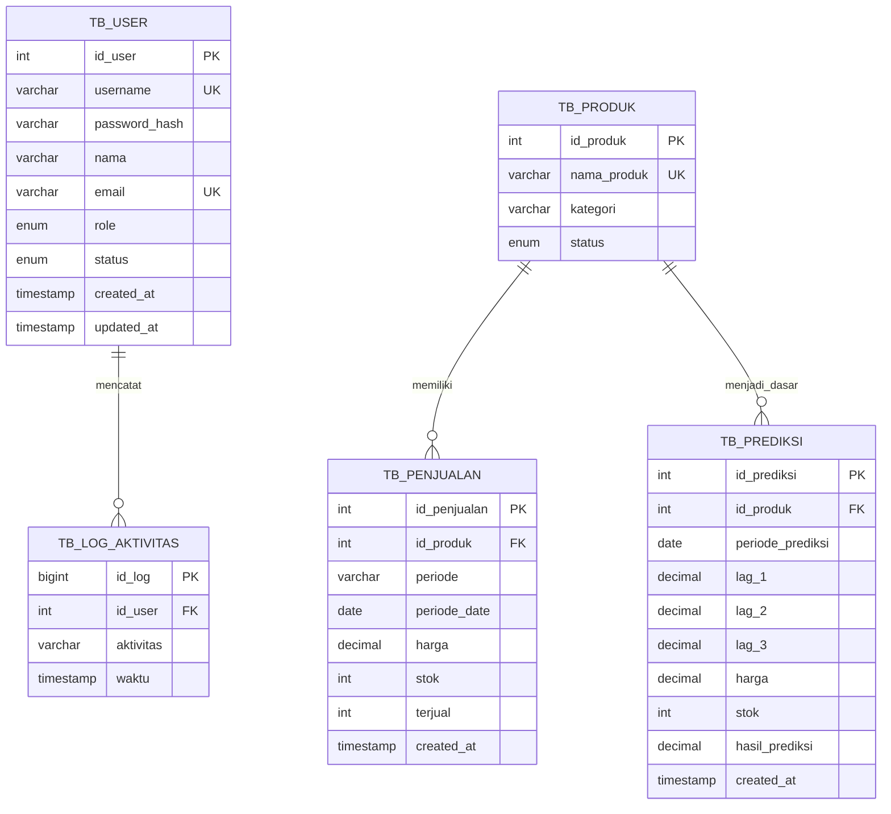

```mermaid
erDiagram
    TB_USER ||--o{ TB_LOG_AKTIVITAS : mencatat
    TB_PRODUK ||--o{ TB_PENJUALAN : memiliki
    TB_PRODUK ||--o{ TB_PREDIKSI : menjadi_dasar

    TB_USER {
      int id_user PK
      varchar username UK
      varchar password_hash
      varchar nama
      varchar email UK
      enum role
      enum status
      timestamp created_at
      timestamp updated_at
    }
    TB_PRODUK {
      int id_produk PK
      varchar nama_produk UK
      varchar kategori
      enum status
    }
    TB_PENJUALAN {
      int id_penjualan PK
      int id_produk FK
      varchar periode
      date periode_date
      decimal harga
      int stok
      int terjual
      timestamp created_at
    }
    TB_PREDIKSI {
      int id_prediksi PK
      int id_produk FK
      date periode_prediksi
      decimal lag_1
      decimal lag_2
      decimal lag_3
      decimal harga
      int stok
      decimal hasil_prediksi
      timestamp created_at
    }
    TB_LOG_AKTIVITAS {
      bigint id_log PK
      int id_user FK
      varchar aktivitas
      timestamp waktu
    }
```
